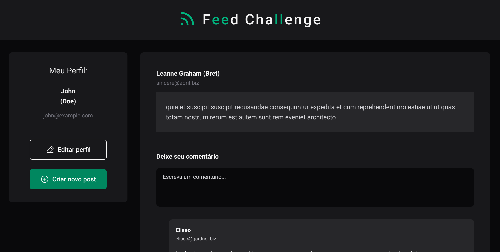
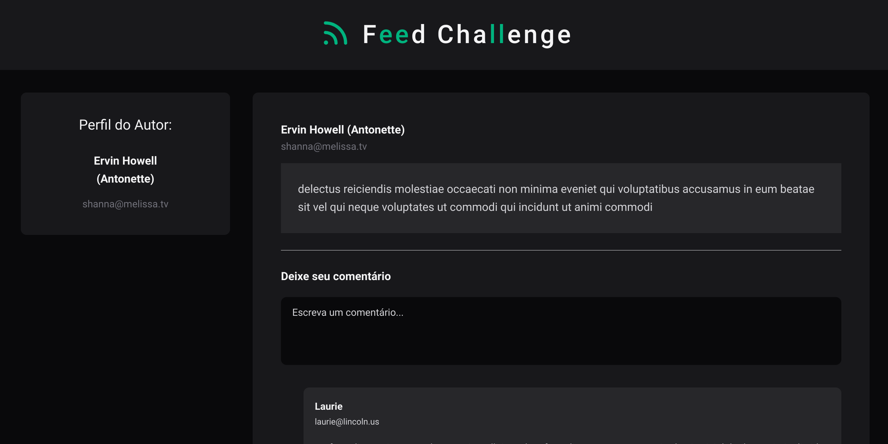
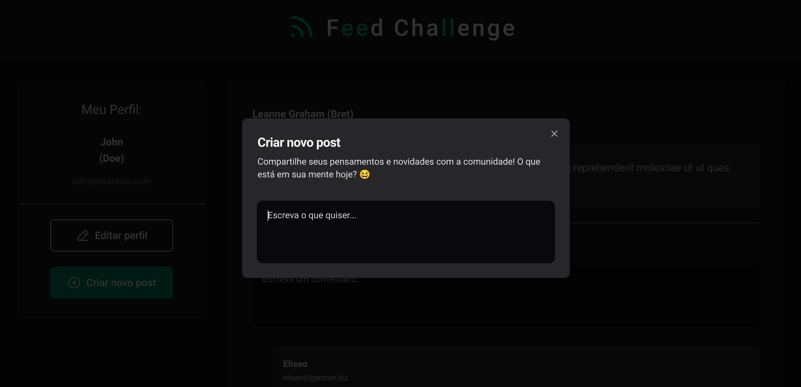
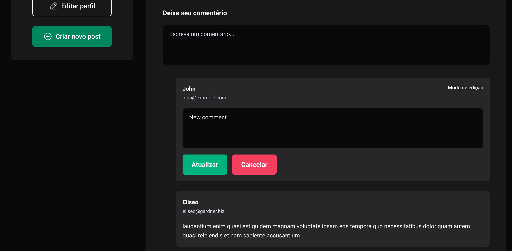
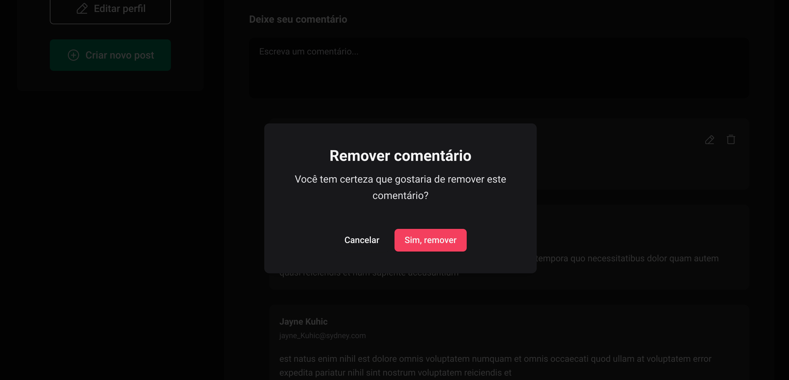
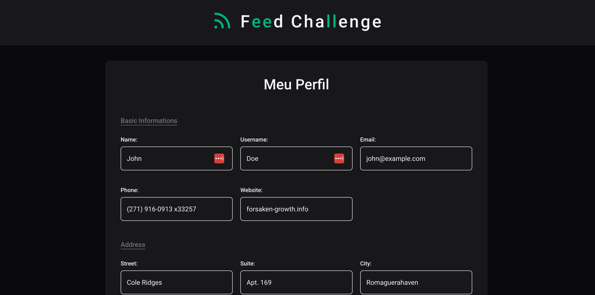

# Feed Challenge

Bem-vindo(a) ao **Feed Challenge**, um projeto que consiste em um feed de posts, parecido com o Twitter/X, utilizando a api fornecida pelo [JSON Placeholder](https://jsonplaceholder.typicode.com/) para buscar os usuários, posts e comentários.

Esse projeto faz parte do desafio proposto pela Kolab, utilizando React e Typescript.

## Screenshots

<p align="center">
  
</p>

<p align="center">
  
</p>

<p align="center">
  
</p>

<p align="center">
  
</p>

<p align="center">
  
</p>

<p align="center">
  
</p>

## 🛠️ Principais Tecnologias

- React
- Typescript
- React Router
- Tanstack Query
- Tailwind CSS
- Shadcn/UI
- React Hook Form
- Zod
- Playwright


## 🚀 Principais Funcionalidades

1. **Feed de Posts**
   
   A home page da aplicação exibe a listagem de posts dos usuários em um feed, contendo:
     - Conteúdo do post
     - Autor do post
     - Comentários do post

   Além disso, o usuário logado pode criar, editar ou remover um comentário que ele fez em um post

2. **Posts de um usuário**

   Ao clicar em um usuário, redireciona para uma página que mostra os posts do usuário clicado

3. **Gerenciamento de posts**

   O usuário logado pode cadastrar novos posts. Ele também pode editar e remover estes posts.

4. **Perfil**

   O usuário logado consegue visitar uma página específica para visualizar e editar seus dados.

## ☑️ Tarefas extras implementadas

- Testes automatizados (end-to-end)
- Gerenciamento de erros

## ⚠️ Requisitos para a instalação
```
## Para ver a versão do node:
node -v
```

```
## Para ver a versão do yarn:
yarn -v
```

É necessário que você tenha em sua máquina uma versão do **node >= 18** e a do **yarn >= 1**. Caso não possua algum desses dois requisitos, você poderá seguir o passo a passo para a instalação nos links abaixo:

[Como instalar o node em qualquer sistema operacional](https://efficient-sloth-d85.notion.site/Instalando-o-Node-js-d40fdabe8f0a491eb33b85da93d90a2f)

[Como instalar o yarn em qualquer sistema operacional](https://efficient-sloth-d85.notion.site/Instalando-o-Yarn-eca6a13be5b3467d8d2f7be15c60f322)

<!-- É necessário fazer a instalação de alguns plugins para o VSCode, com o intuito de facilitar na hora do desenvolvimento:

[ESLint](https://marketplace.visualstudio.com/items?itemName=dbaeumer.vscode-eslint)

[PostCSS Language Support](https://marketplace.visualstudio.com/items?itemName=csstools.postcss)

[Tailwind CSS IntelliSense](https://marketplace.visualstudio.com/items?itemName=bradlc.vscode-tailwindcss) -->


## 👣 Passo a passo para rodar o projeto em sua máquina

1 - Para clonar o projeto:
```
git clone https://github.com/joaoD3V/feed-challenge.git
```
2 - Para instalar as dependências do projeto:
```
yarn install
```
3 - Para rodar o projeto em ambiente de desenvolvimento:
```
yarn dev
```
4 - Para rodar o projeto em ambiente de produção:
```
yarn build && yarn preview
```
---
**Para rodar os testes automatizados (end-to-end):**

Antes de rodar os testes, instale o Playwright:
```
yarn playwright install
```

Para rodar os testes no terminal:
```
yarn playwright test
```

Para rodar os testes na interface:
```
yarn playwright test --ui
```

---

Feito com ♥ by joaoD3V